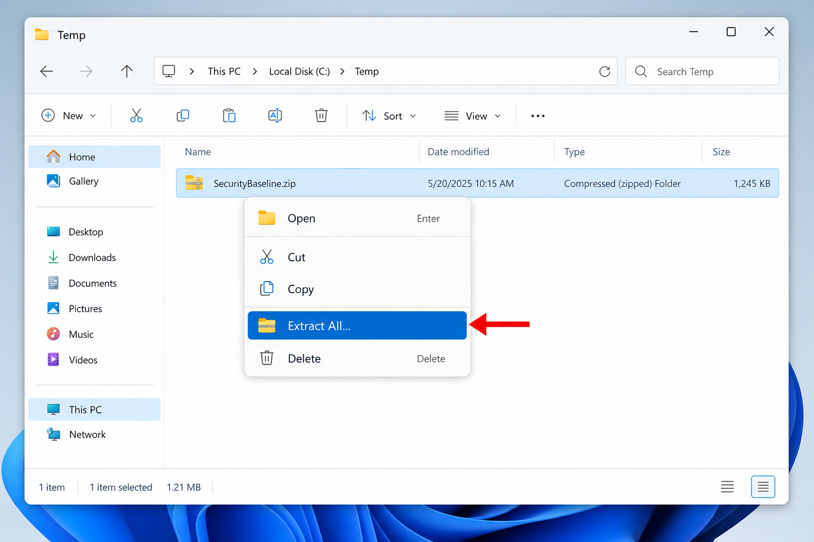
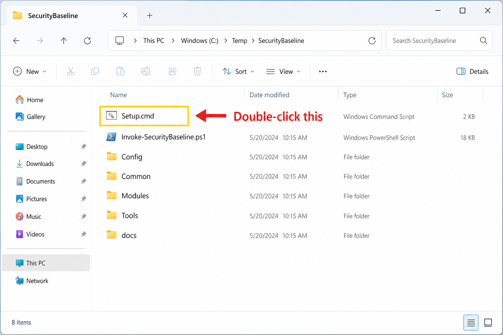
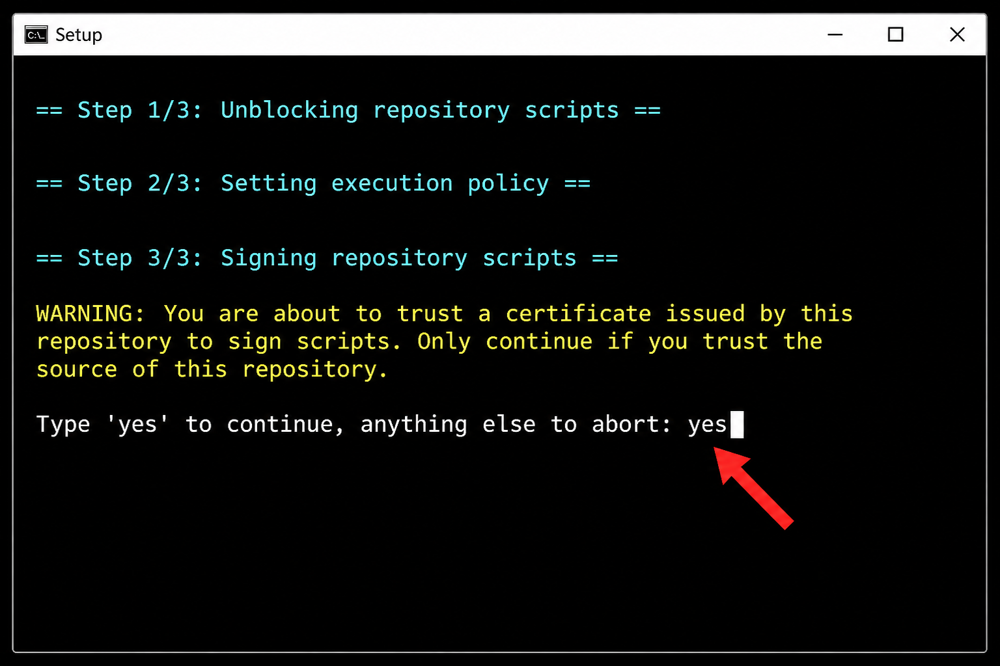
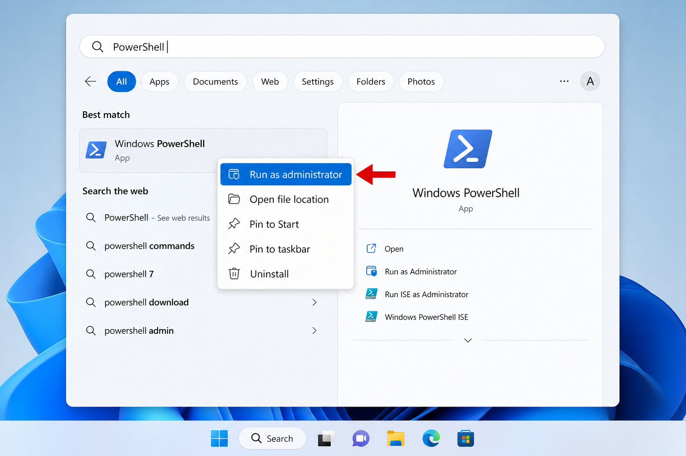
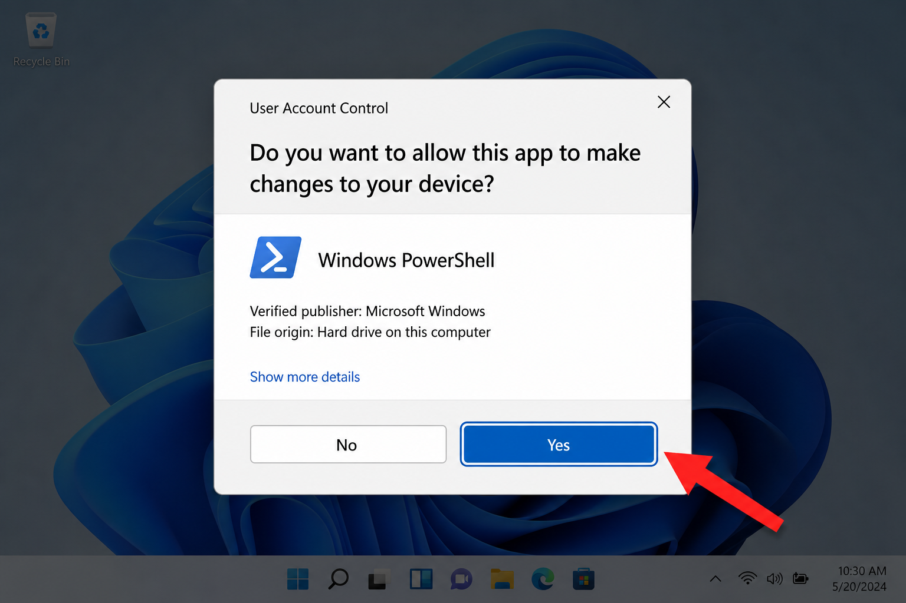
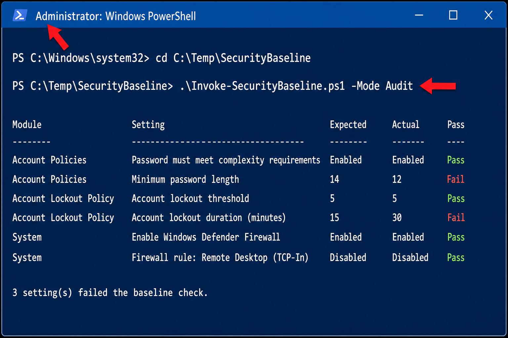
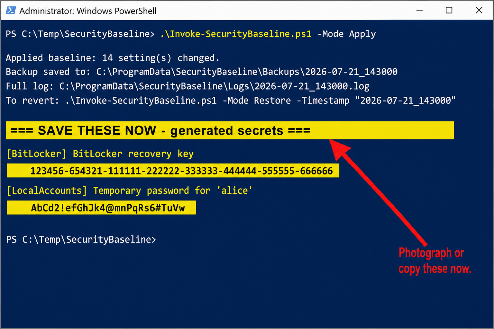
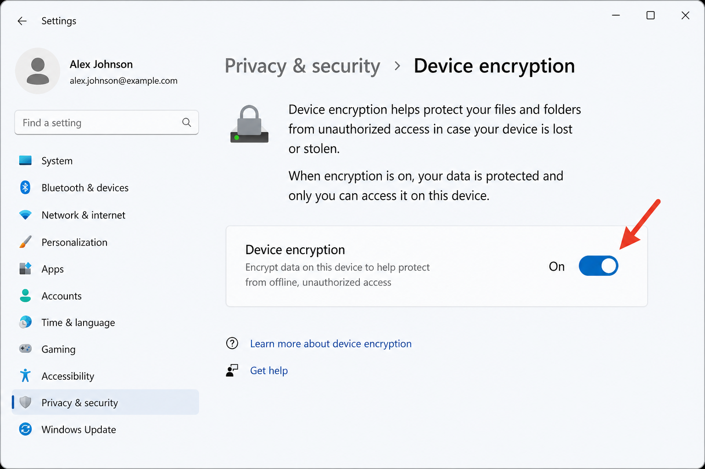

# Security Baseline — Step-by-Step User Manual

> **Windows users:** open [`USER-MANUAL.html`](USER-MANUAL.html) instead — double-click it on any Windows PC (opens in Microsoft Edge). It is a single self-contained file with all pictures included.

This guide walks you through installing and running the **Security Baseline** toolkit on a **clean Windows 11 computer**, when the files arrive as a **ZIP archive**.

You do **not** need to be an IT professional. Follow the steps in order. If a step asks you to type something, copy it exactly.

> **About the pictures:** The screenshots below are **generic examples** to show you what to look for. Your Windows theme, colors, and exact wording may look a little different — follow the arrows and the matching text in each step.

---

## What this toolkit does

This toolkit strengthens the security settings on a Windows 11 PC — things like stronger passwords, automatic screen lock, Windows Defender, the firewall, encryption (BitLocker), and related protections.

It has three main jobs:

| Job | What it means for you |
|---|---|
| **Audit** | Look at the computer and tell you what’s already secure and what isn’t. **Changes nothing.** |
| **Apply** | Turn on the recommended security settings. **Makes changes.** It also saves a backup first so you can undo later. |
| **Restore** | Undo the last Apply (or a specific backup) and put settings back. |

**Recommended order every time:** Audit → review the report → Apply → save any secrets it prints → reboot if asked.

---

## Before you start — checklist

Confirm all of these:

1. **Windows 11** (Home, Pro, or Enterprise).
2. You can sign in with an account that is an **Administrator** on this PC.
3. The computer is **not** joined to a company domain that already manages security with Group Policy. This toolkit is for standalone / workgroup machines.
4. You have the **ZIP file** (on a USB drive, email download, shared folder, etc.).
5. You have about **15–30 minutes**, plus extra time if disk encryption starts (that can continue in the background).
6. A notebook, phone camera, or USB stick ready — Apply may show **recovery keys / temporary passwords** you must save immediately.

### Important warnings (read once)

- **Apply changes the computer.** That’s the point. Start with **Audit** if you want a report first with no changes.
- After Apply, watch for a bright yellow message: **`SAVE THESE NOW`**. Copy those values somewhere safe **before** you close the window.
- On some Windows 11 **Home** PCs, one encryption step must be done once by hand in Settings (explained later). Don’t skip that section if encryption fails.
- Eject any **CD/DVD** (or virtual disc) before Apply if BitLocker/encryption is involved — a mounted disc has been known to block encryption with a confusing error.

---

## Part 1 — Get the files onto the computer

### Step 1. Copy the ZIP to the PC

1. Plug in the USB drive, open the email, or open the folder where the ZIP was shared.
2. Copy the ZIP file to a simple place on the PC, for example:
   - `C:\Temp\`
   - or your Desktop

Avoid putting it only inside a temporary browser “Downloads” folder if you’ll need it again later — keep a copy somewhere permanent until the job is finished.

### Step 2. Extract (unzip) the archive

1. Right-click the ZIP file.
2. Choose **Extract All…** (wording may vary slightly).



3. Choose a destination, for example:
   - `C:\Temp\SecurityBaseline`
4. Click **Extract**.
5. Open the new folder. You should see files such as:
   - `Setup.cmd`
   - `Invoke-SecurityBaseline.ps1`
   - folders named `Config`, `Common`, `Modules`, `Tools`, `docs`



If you only see one nested folder after extract, open that folder until you see `Setup.cmd`. **All later commands must be run from the folder that contains `Setup.cmd`.**

> Tip: Keep the full extracted folder. Don’t move individual scripts out of it — they need the other folders next to them.

---

## Part 2 — One-time setup (required)

Windows often blocks scripts that arrived from another computer (ZIP downloads are treated as “from the internet”). The setup program fixes that and prepares the PC so the toolkit can run.

### Step 3. Run Setup

1. Open the extracted folder (the one with `Setup.cmd`).
2. Double-click **`Setup.cmd`** (see the highlighted file in the picture above).
3. A black window opens and runs three steps:
   - Unblock the script files
   - Allow signed scripts to run for your account
   - Sign the scripts with a certificate created for this PC
4. When you see a warning and a prompt like:
   ```text
   Type 'yes' to continue, anything else to abort
   ```
   type exactly:

   ```text
   yes
   ```

   then press **Enter**.



5. Wait until you see a message that prerequisites are complete (it will mention you can run `Invoke-SecurityBaseline.ps1`).
6. If the window says **Press any key to continue…**, press a key to close it.

If Setup fails, write down the red/error text and see [Troubleshooting](#troubleshooting) at the end.

**You only need to do Setup once per user account on this PC**, unless someone later edits the script files (then run Setup again).

---

## Part 3 — Open PowerShell as Administrator

The main toolkit **must** run with administrator rights. A normal PowerShell window is not enough.

### Step 4. Open an elevated PowerShell window

1. Click the **Start** button.
2. Type: `PowerShell`
3. You should see **Windows PowerShell**.
4. Right-click it → choose **Run as administrator**.



5. If Windows asks **Do you want to allow this app to make changes?**, click **Yes**.



You should see a blue (or dark) window. The title bar often includes the word **Administrator**.

### Step 5. Go to the toolkit folder

In that window, type a command that matches where you extracted the files.

Example if you used `C:\Temp\SecurityBaseline`:

```powershell
cd C:\Temp\SecurityBaseline
```

Press **Enter**.

To confirm you’re in the right place, type:

```powershell
dir Setup.cmd
```

You should see `Setup.cmd` listed. If you get “cannot find”, you’re in the wrong folder — fix the path and try again.

---

## Part 4 — Check first (Audit) — recommended

Audit does **not** change settings. It only reports.

### Step 6. Run Audit

Type this exactly and press **Enter**:

```powershell
.\Invoke-SecurityBaseline.ps1 -Mode Audit
```



What you should see:

- The word **Administrator** in the window title
- A table of checks (module, setting, expected vs actual, pass/fail)
- A short summary at the end (how many passed / failed)

Reports and logs are also saved under:

```text
C:\ProgramData\SecurityBaseline\
```

Typical locations:

| Item | Folder |
|---|---|
| Audit report | `C:\ProgramData\SecurityBaseline\Reports\` |
| Log file | `C:\ProgramData\SecurityBaseline\Logs\` |

You can open those folders in File Explorer (paste the path into the address bar).

If Audit fails immediately with a message about needing an **elevated** session, go back to [Step 4](#step-4-open-an-elevated-powershell-window) and make sure you used **Run as administrator**.

---

## Part 5 — Apply the security baseline

Only continue when you’re ready for the PC’s settings to change.

### Step 7. Run Apply

In the same Administrator PowerShell window (still in the toolkit folder), type:

```powershell
.\Invoke-SecurityBaseline.ps1 -Mode Apply
```

Press **Enter** and wait. This can take several minutes.

At the end you should see something like:

- How many settings changed
- Where the **backup** was saved
- Where the **log** was saved
- How to restore if needed

### Step 8. Save secrets immediately (critical)

If Apply created a BitLocker recovery key and/or temporary account passwords, a bright banner appears:

```text
=== SAVE THESE NOW - generated secrets ===
```



**Do this before you close the window:**

1. Photograph the screen **or** copy the values into a password manager / printed note kept in a locked place.
2. Also open these folders in File Explorer if they exist and copy the files to a **safe online location** (Google Drive, external storage platform, etc.):

| Secret | Usual location |
|---|---|
| BitLocker recovery key | `C:\ProgramData\SecurityBaseline\RecoveryKeys\` |
| Temporary account passwords | `C:\ProgramData\SecurityBaseline\TemporaryPasswords\` |

3. After you’ve stored them safely, remove or relocate the local copies if your process requires that — **never rely only on the PC you’re hardening** as the only place the recovery key lives.

Without the BitLocker recovery key, a future hardware/firmware problem can make the drive **unreadable**. Treat that file like a spare house key.

### Step 9. Reboot when convenient

Some settings (and encryption progress) settle best after a restart.

1. Save your work in other programs.
2. Restart Windows normally.
3. Sign back in.

If Apply set a temporary password on an account, that account may be asked to **choose a new password** at next sign-in. Use the temporary password from Step 8 once, then set a strong personal password.

---

## Part 6 — Windows 11 Home and encryption (BitLocker / Device encryption)

On many PCs this works automatically during Apply. On **Windows 11 Home**, if the drive was never encrypted before, Apply may say it needs a **one-time manual step**.

### Step 10. One-time Device encryption kickoff (only if needed)

1. First, eject any CD/DVD or virtual disc (right-click the drive in File Explorer → Eject).
2. Open **Settings**.
3. Go to **Privacy & security** → **Device encryption**.
4. Turn **Device encryption** **On**.



5. If Windows asks you to sign in with a Microsoft account to “finish” encrypting:
   - You can **dismiss / skip** that sign-in for this toolkit’s purposes.
   - Flipping the toggle alone is what stages the volume.
6. Return to the Administrator PowerShell window (toolkit folder) and run Apply again:

```powershell
.\Invoke-SecurityBaseline.ps1 -Mode Apply
```

After that first staging, later Apply runs can manage encryption without repeating the Settings toggle.

### Confirm encryption later (optional)

After some time (encryption can take a while on a full disk), you can Audit again:

```powershell
.\Invoke-SecurityBaseline.ps1 -Mode Audit
```

Or ask your IT contact to verify BitLocker / Device encryption status for you.

---

## Part 7 — Verify it worked

### Step 11. Run Audit again

```powershell
.\Invoke-SecurityBaseline.ps1 -Mode Audit
```

You should see far more **Pass** results than before. A few items may still fail if hardware doesn’t support them (for example, no TPM for encryption) — write those down for your IT / compliance contact.


---

## Part 8 — Undo changes (Restore)

Every Apply creates a backup first. Use Restore only if you need to roll back.

### Restore the most recent Apply

In Administrator PowerShell, from the toolkit folder:

```powershell
.\Invoke-SecurityBaseline.ps1 -Mode Restore -Latest
```

### Restore a specific backup

If the Apply summary printed a timestamp (or you see a folder name under `C:\ProgramData\SecurityBaseline\Backups\`), use that name:

```powershell
.\Invoke-SecurityBaseline.ps1 -Mode Restore -Timestamp "2026-07-21_143000"
```

Replace the date/time string with your real backup folder name.

### About BitLocker during Restore

By default, Restore **does not turn off disk encryption** (turning encryption off is slow and risky if done by accident).

Only use the decrypt option if someone who understands the risk explicitly asks you to:

```powershell
.\Invoke-SecurityBaseline.ps1 -Mode Restore -Latest -DecryptOnRestore
```

**Do not use `-DecryptOnRestore` on a production PC unless instructed.**

---

## Everyday reference — commands cheat sheet

Always open **Windows PowerShell as Administrator**, then `cd` to the toolkit folder.

| Goal | Command |
|---|---|
| Check only | `.\Invoke-SecurityBaseline.ps1 -Mode Audit` |
| Apply settings | `.\Invoke-SecurityBaseline.ps1 -Mode Apply` |
| Undo last Apply | `.\Invoke-SecurityBaseline.ps1 -Mode Restore -Latest` |
| One-time prep after unzip | Double-click `Setup.cmd` |

---

## What Apply typically changes (overview)

You don’t need to memorize this list. It’s here so nothing feels “mysterious” after Apply.

- Password length / complexity / history rules  
- Account lockout after repeated failed sign-ins  
- Windows Defender real-time and cloud protection  
- Firewall on for common profiles; inbound default block  
- Auto lock after idle time  
- More detailed security audit logging  
- Remote Desktop off; old SMBv1 off; Guest account off  
- BitLocker / device encryption (when the PC supports it)  
- Autologon off; blank-password accounts get a temporary password  
- Windows Update kept automatic  
- PowerShell activity logging  
- USB write blocked (read still allowed)  
- Stronger User Account Control prompts  
- Hardening of older network authentication features  
- Larger Windows event logs so history isn’t wiped too quickly  

Default values live in `Config\Baseline.config.psd1`. Changing that file is optional and best done with IT guidance **before** Apply. If someone edits scripts or config later, run **`Setup.cmd` again** before the next Audit/Apply.

---

## Where things are saved on the PC

| What | Where |
|---|---|
| Backups from Apply | `C:\ProgramData\SecurityBaseline\Backups\` |
| Logs | `C:\ProgramData\SecurityBaseline\Logs\` |
| Audit reports | `C:\ProgramData\SecurityBaseline\Reports\` |
| BitLocker recovery keys | `C:\ProgramData\SecurityBaseline\RecoveryKeys\` |
| Temporary passwords | `C:\ProgramData\SecurityBaseline\TemporaryPasswords\` |
| PowerShell transcripts (after Apply) | `C:\ProgramData\SecurityBaseline\PowerShellTranscripts\` |

`C:\ProgramData` is a system folder. In File Explorer, paste the full path into the address bar and press Enter. You may need to be signed in as an administrator to open some of it.

---

## Troubleshooting

### “This script must be run from an elevated (Administrator) PowerShell session”

You opened PowerShell without administrator rights. Close it and repeat [Step 4](#step-4-open-an-elevated-powershell-window).

### “is not digitally signed” / scripts won’t run

1. Close PowerShell.
2. Run **`Setup.cmd`** again from the extracted folder.
3. Type `yes` when asked.
4. Open a **new** Administrator PowerShell window and try again.

### Double-clicking a `.ps1` file does nothing useful / flashes and closes

Don’t double-click `Invoke-SecurityBaseline.ps1`. Always run it from an Administrator PowerShell window with the commands in this manual.

### Setup window closes too fast / failed

1. Open the extracted folder.
2. In the address bar of File Explorer, type `cmd` and press Enter (opens a command window in that folder).
3. Type:

   ```cmd
   Setup.cmd
   ```

4. Read the full message. Photograph it if you need help.

### Path / “cannot find path” errors

You’re not in the folder that contains `Setup.cmd` and `Invoke-SecurityBaseline.ps1`. Use `cd` to that folder (see [Step 5](#step-5-go-to-the-toolkit-folder)).

### BitLocker / encryption errors mentioning the Windows edition or “does not support this feature”

1. Eject CD/DVD / virtual discs.
2. On Home, do the Device encryption toggle in [Step 10](#step-10-one-time-device-encryption-kickoff-only-if-needed).
3. Run Apply again.
4. If it still fails, save the log from `C:\ProgramData\SecurityBaseline\Logs\` and contact IT — the PC may lack TPM or other hardware prerequisites.

### USB stick won’t accept new files after Apply

That’s often intentional: write access to removable drives is blocked; reading usually still works. If you must copy files out, ask IT whether to temporarily exclude that control or restore/adjust config.

### Remote Desktop stopped working

Also often intentional. If remote support is required, an IT person can re-run Apply with Remote Desktop left enabled via configuration, or restore and adjust settings.

### You closed the window before saving the yellow “SAVE THESE NOW” values

Check:

- `C:\ProgramData\SecurityBaseline\RecoveryKeys\`
- `C:\ProgramData\SecurityBaseline\TemporaryPasswords\`

If those folders are empty and you need the values, contact IT immediately — do not wait until a recovery situation.

---

## Suggested run order (summary)

Use this as a one-page checklist on a clean PC:

1. Copy ZIP to the PC.  
2. Extract All → open folder until you see `Setup.cmd`.  
3. Double-click `Setup.cmd` → type `yes` → wait for success.  
4. Start → PowerShell → **Run as administrator**.  
5. `cd` to the extracted folder.  
6. `.\Invoke-SecurityBaseline.ps1 -Mode Audit`  
7. `.\Invoke-SecurityBaseline.ps1 -Mode Apply`  
8. Save everything under **SAVE THESE NOW** + copy RecoveryKeys / TemporaryPasswords off the machine.  
9. Restart Windows.  
10. If encryption complained on Home: Settings → Privacy & security → Device encryption → On, then Apply again.  
11. Run Audit once more and keep the report.  
12. If something went wrong and you must undo: `.\Invoke-SecurityBaseline.ps1 -Mode Restore -Latest`

---

## Getting help

When asking for help, send:

1. Exact wording of the error (photo of the PowerShell window is fine).  
2. Whether you ran **Setup.cmd** successfully.  
3. Whether PowerShell said **Administrator** in the title.  
4. The newest files from:
   - `C:\ProgramData\SecurityBaseline\Logs\`
   - `C:\ProgramData\SecurityBaseline\Reports\`
5. Windows edition: Settings → System → About → **Windows specifications** (Home / Pro / Enterprise).

You do not need to understand every line of the log — the person supporting you does.
